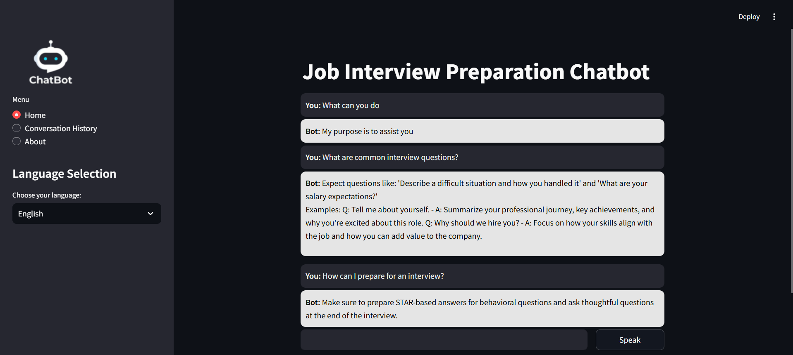

# Job Interview Preparation Chatbot 🤖💼

The Job Interview Preparation Chatbot is designed to assist users in preparing for job interviews. By leveraging Natural Language Processing (NLP) and machine learning techniques, this chatbot provides relevant responses to common interview questions, tips for job seekers, and guidance for effective interview preparation.

---

## 🚀 Features

- **Intent Recognition**: Uses TF-IDF vectorization and Logistic Regression to classify user inputs into predefined categories like common interview questions, tips, etc.
- **Multilingual Support:**: Enables conversation in multiple languages, enhancing accessibility for a wider range of users.
- **Interactive Interface**: Built using Streamlit for a seamless and user-friendly experience.
- **Voice Input**: Allows users to speak questions instead of typing them, making the interaction more natural.
- **Fallback Responses**: When the chatbot cannot recognize user input, it provides generic advice or encourages the user to try again.
- **Conversation Logging**: Logs user interactions, helping in refining and improving the chatbot.

---

## 🛠️ Tools and Technologies

1. **Programming Language**: Python
2. **NLP Libraries**:  
   - NLTK  
   - Scikit-learn (for intent classification using TF-IDF and Logistic Regression)
3. **Frontend Framework**: Streamlit
4. **Voice Recognition**: Google Speech-to-Text
5. **Text-to-Speech**: pyttsx3
6. **Translation**: Google Translate API (for multilingual support)

---

## 🧠 Methodology

1. **Data Preparation**  
   - The chatbot is trained on a structured intents.json file containing various types of job interview questions and their corresponding responses.

2. **Model Development**  
   - TF-IDF vectorizer converts user input into numerical representations.
   - Logistic Regression model is used to predict the intent from the user input.

3. **Response Generation**  
   - Based on the classified intent, the chatbot generates appropriate responses or redirects the user to helpful resources.
   
4. **Voice and Multilingual Interaction**
   - The user can interact by speaking to the chatbot. The voice input is processed and converted into text using speech recognition.
   - The chatbot can respond in multiple languages depending on the user's selection.

5. **Interface and Deployment**  
   - Streamlit is used to create an interactive and responsive web interface.
   -Conversation history is saved for future analysis and improvements.

---
### Screenshots
1. Basic Look 

2. Multi Language Support

3. Speak Option 

4. Conversation History

5. Light Mood

### 🤖Try now:
- **Job Interview Preparation Chatbot:**: [Link]
  
### Prerequisites
- Python 3.8 or above
- Required Python libraries: `nltk`, `streamlit`, `scikit-learn`, `pyttsx3`, `speechrecognition`, `googletrans` 

### Description of Key Files
1. **chatbot.py**
   Contains the core logic of the chatbot, including the training process, voice input handling, response generation, and the Streamlit interface.

2. **intents.json**
   A structured dataset defining user intents, patterns, and corresponding responses for job interview preparation.

3. **requirements.txt**
   A list of dependencies and libraries required to run the chatbot.

4. **chat_log.csv**
   Logs user inputs, chatbot responses, and interaction timestamps during the session.

5. **assets/**
   A folder that stores additional resources such as pre-downloaded datasets or any media for the chatbot.
---

## 📬 Contact

If you have any questions, feedback, or suggestions, feel free to reach out:

- **Author**: Nikunj Patel  
- **Email**: [patelnikunj2411@gmail.com](mailto:patelnikunj2411@gmail.com)  
- **GitHub**: [Nikunj-Patel](https://github.com/Nikunjpatel2411)  
- **LinkedIn**: [Nikunj_Patel](https://www.linkedin.com/in/nikunj-patel-68b428214/)  

We appreciate your interest in Job Interview Preparation Chatbot and look forward to hearing from you!

